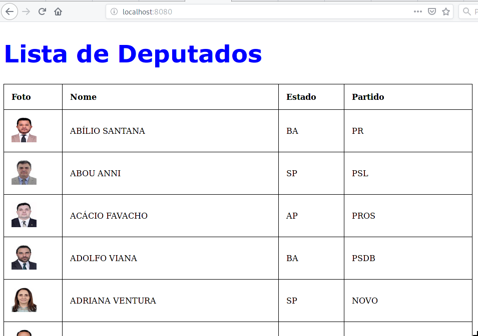

Laboratório do Módulo 5 
======

# Como trabalhar

Vamos colocar em prática o que aprendemos sobre a linguagem Python para desenvolvimento WEB. 

Esse laboratório propoe um problema e suas soluções. O aluno deve trabalhar como `code review`, isso é entender o código e fazer modificações construindo assim o seu conhecimento.

> Ao final do laboratório proponha perguntas para você mesmo e tente responde-lás desenvolvendo o código em Python.


# Problema

No site 'dados abertos' da câmera de deputados federal (https://dadosabertos.camara.leg.br/) temos todas as informações de ações e gastos dos deputados federais.


Com essa informação, vamos responder as perguntas abaixo.desenvolvendo os códigos em Python.

Vamos utilizar os seguintes recursos da linguagem:
* Flask;
* Database;
* Json;

------

1. **Construa uma aplicação WEB que mostra uma tabela com cadastro dos deputados (Foto, Nome, Estado e Partido)**

{width: 200px;}

> Codificação: [m5_lab1](code/m5_lab1/)

Sugestão de alteração:
  1. Acrescente na listagem o ID do deputado;
  2. Altere o CSS, da tabela;
	 
2. **Construa uma aplicação WEB que mostra uma tabela com cadastro do deputado (Foto, Id,Nome, Estado e Partido); ao clicar no nome do deputado, uma nova janela apresenta o cadastro completa do deputado**
   
> Codificação: [m5_lab2.py](code/m5_lab2/)

3. **Construa uma aplicação WEB que mostra uma tabela com cadastro do deputado (Foto, Id,Nome, Estado e Partido); ao clicar no nome do deputado, uma nova janela apresenta o cadastro completa do deputado**

    
> Codificação: [m5_lab3.py](code/m5_lab3/)

4. **Lista as descrição e o valor das despesas de um deputado (pode ser qualquer um):**

> Codificação: [m5_lab4.py](code/m5_lab4/)
	
5. **Lista os titulos em maiúsculo dos orgãos (comissão) do Congresso.:**
   
> Codificação: [m5_lab5.py](code/m5_lab5/)
6. **Lista os deputados que participam da comissão que tem o ID 5973:**
   
> Codificação: [m5_lab6.py](code/m5_lab6/)


***
> By:
```python
Autor   = ['Clodonil Honorio Trigo','clodonil@nisled.org']
linkdin = 'https://www.linkedin.com/in/clodonil-trigo-4155722a'
Blog    = 'http://www.devops-sys.com.br'
```
