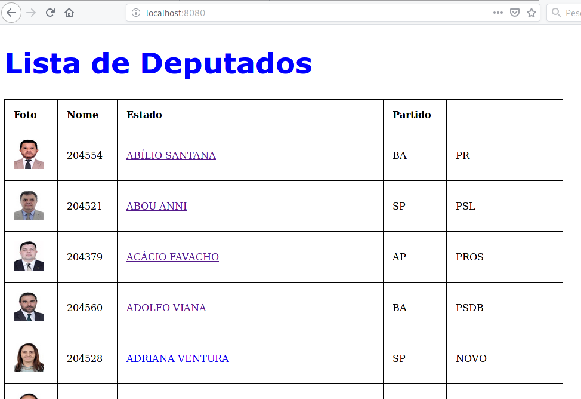
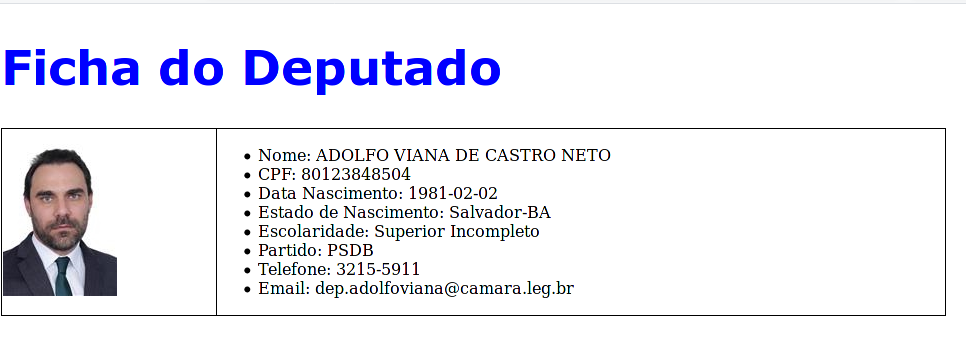

#**Construa uma aplicação WEB que mostra uma tabela com cadastro do deputado (Foto,Nome, Estado e Partido); ao clicar no nome do deputado, uma nova janela apresenta o cadastro completa do deputado**

##Tela1

##Tela2
