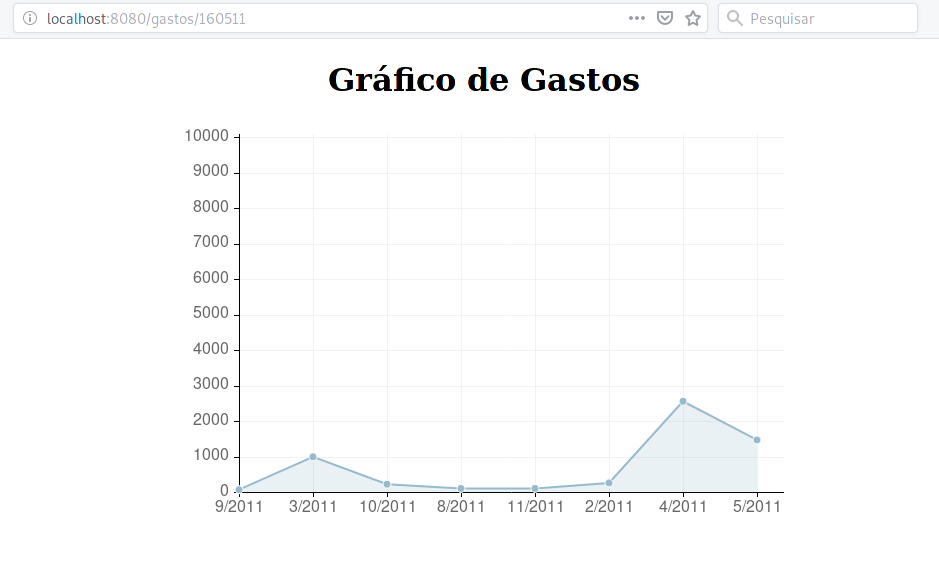

# **Construa uma aplicação WEB que mostra uma tabela com cadastro do deputado (Foto, Nome, Estado e Partido), adicione um link para mostrar um gráfico dos gastos dos deputados organizado por mês;**
   
## Tela1

## Tela2
